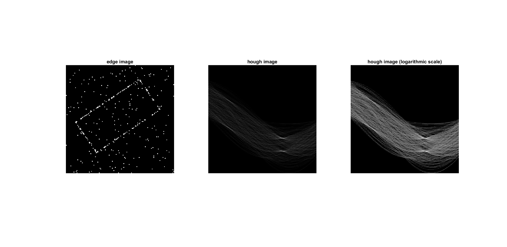
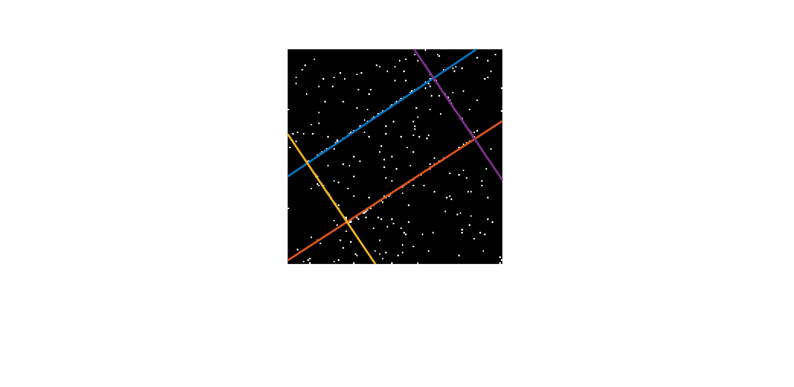
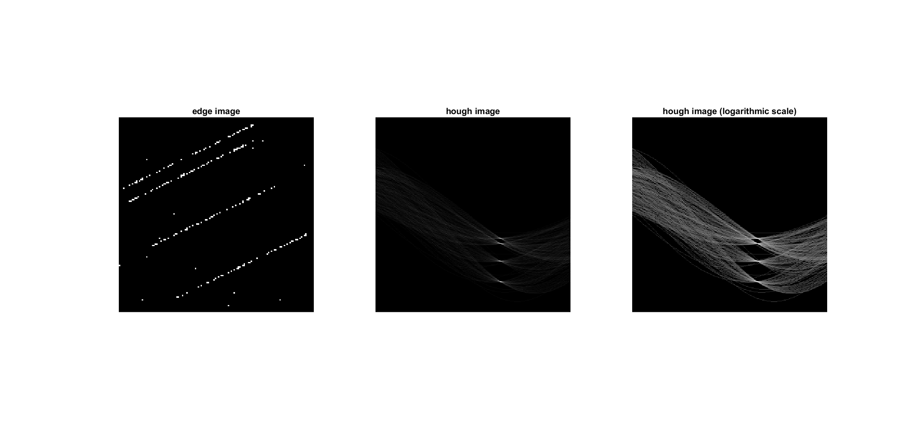

# HoughTransform_Lines

Figure showing the edge image and the hough image
 

Corresponding straight lines in the edge image
 

Figure showing the edge image and the hough image
 

Corresponding straight lines in the edge image
 

